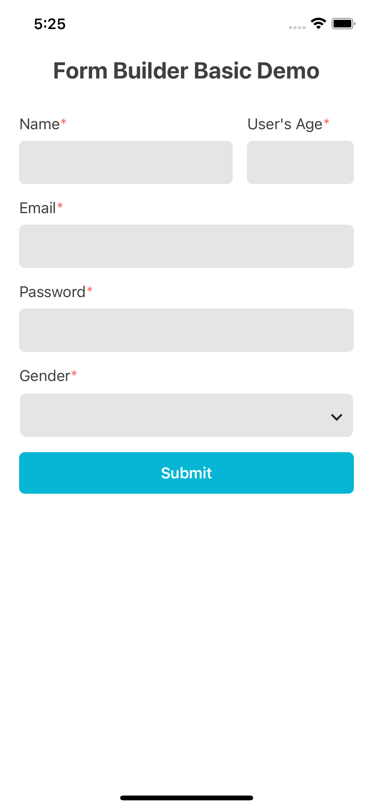

# native-base-form-builder

[](https://www.npmjs.com/package/native-base-form-builder)
[](https://www.npmjs.com/package/native-base-form-builder)
[](https://www.npmjs.com/package/native-base-form-builder)
[](https://github.com/fateh999/native-base-form-builder/blob/master/LICENSE)

Form Builder written in typescript with inbuilt Validation, dropdown, autocomplete powered by [react-hook-form](https://react-hook-form.com/) & [native-base](https://nativebase.io/).

#### Dependencies to Install :

- [native-base](https://www.npmjs.com/package/native-base)

- [react-hook-form](https://www.npmjs.com/package/react-hook-form)

#### Note :

For maintainability this library will only target latest versions of react-hook-form and native-base.

#### Documentation :

- [https://fateh999.github.io/native-base-form-builder](https://fateh999.github.io/native-base-form-builder)

#### Demo :



#### Steps to install :

```javascript

npm install native-base-form-builder

```

or

```javascript

yarn add native-base-form-builder

```

```javascript
import {FormBuilder} from 'native-base-form-builder';
```

<p><a href="https://www.buymeacoffee.com/fateh999"> </a></p><br><br><br>
